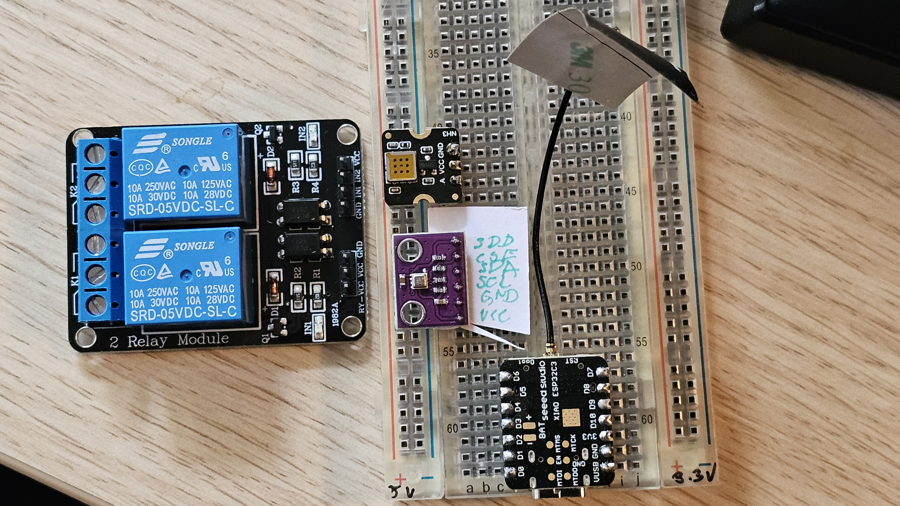

# HW docs

## Links
- [Relays](https://botland.com.pl/moduly-przekaznikow/14266-modul-przekaznikow-iduino-2-kanaly-z-optoizolacja-styki-10a250vac-cewka-5v-5903351242332.html)
- [Amonia sensor](https://botland.com.pl/czujniki-gazow/23744-fermion-czujnik-amoniaku-nh3-mems-1-300ppm-dfrobot-sen0567-6959420923809.html)
- [Temp and humidity](https://botland.com.pl/czujniki-cisnienia/16534-bme280-czujnik-wilgotnosci-temperatury-oraz-cisnienia-110kpa-i2c-spi-33v-wlutowane-zlacza-5904422378189.html)
- [Small boards](https://botland.com.pl/moduly-wifi-i-bt-esp32/21859-seeed-xiao-esp32-c3-wifibluetooth-seeedstudio-113991054.html)

## Local files with documents
[Instruction ESP32 C3 in PDF](specs/Seeed-Studio.pdf)

## Component docs

### Relay
Check the photo for more details

Connect to the board:
RYVcc-Vcc jumper
GND - board / usb GND
VCC - 5V VCC V-usb
IN1 - D0

### bme280
vcc - 3.3v
SDA - D4
SCL - D5

### Amonia sensor

WIP

# breadboard

Here’s what the board looks like:

## schematics

