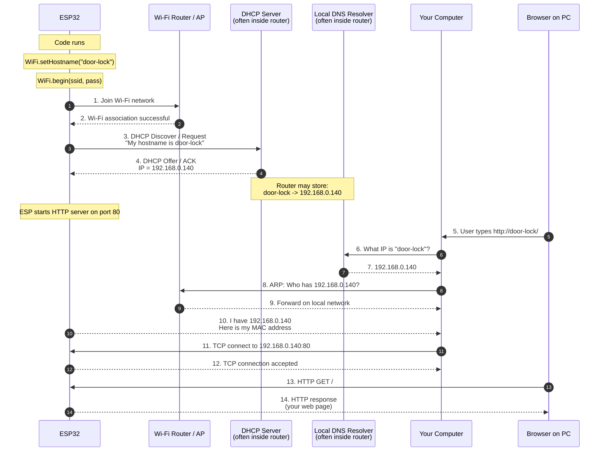
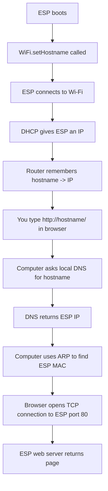
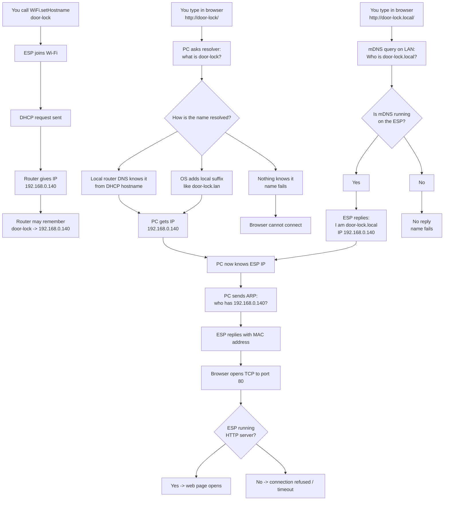
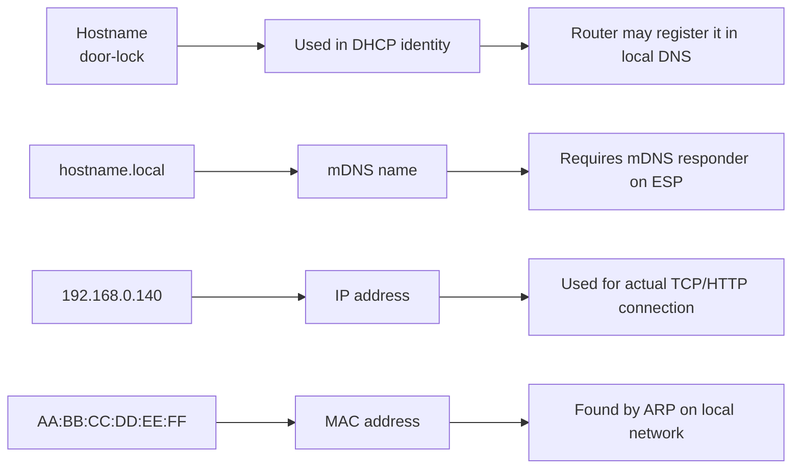

ESP32 network connection and HTTP server - how it works:

```mermaid

sequenceDiagram
    autonumber
    participant ESP as ESP32
    participant AP as Wi-Fi Router / AP
    participant DHCP as DHCP Server<br/>(often inside router)
    participant DNS as Local DNS Resolver<br/>(often inside router)
    participant PC as Your Computer
    participant Browser as Browser on PC

    Note over ESP: Code runs
    Note over ESP: WiFi.setHostname("door-lock")
    Note over ESP: WiFi.begin(ssid, pass)

    ESP->>AP: 1. Join Wi-Fi network
    AP-->>ESP: 2. Wi-Fi association successful

    ESP->>DHCP: 3. DHCP Discover / Request<br/>"My hostname is door-lock"
    DHCP-->>ESP: 4. DHCP Offer / ACK<br/>IP = 192.168.0.140

    Note over DHCP,DNS: Router may store:<br/>door-lock -> 192.168.0.140

    Note over ESP: ESP starts HTTP server on port 80

    Browser->>PC: 5. User types http://door-lock/
    PC->>DNS: 6. What IP is "door-lock"?
    DNS-->>PC: 7. 192.168.0.140

    PC->>AP: 8. ARP: Who has 192.168.0.140?
    AP-->>PC: 9. Forward on local network
    ESP-->>PC: 10. I have 192.168.0.140<br/>Here is my MAC address

    PC->>ESP: 11. TCP connect to 192.168.0.140:80
    ESP-->>PC: 12. TCP connection accepted

    Browser->>ESP: 13. HTTP GET /
    ESP-->>Browser: 14. HTTP response<br/>(your web page)

```

Logic map:

```mermaid
flowchart TD
    A[ESP boots] --> B[WiFi.setHostname called]
    B --> C[ESP connects to Wi-Fi]
    C --> D[DHCP gives ESP an IP]
    D --> E[Router remembers hostname -> IP]
    E --> F[You type http://hostname/ in browser]
    F --> G[Computer asks local DNS for hostname]
    G --> H[DNS returns ESP IP]
    H --> I[Computer uses ARP to find ESP MAC]
    I --> J[Browser opens TCP connection to ESP port 80]
    J --> K[ESP web server returns page]
```

Diagram2

```mermaid
flowchart TD
    A[You call WiFi.setHostname<br/>door-lock] --> B[ESP joins Wi-Fi]
    B --> C[DHCP request sent]
    C --> D[Router gives IP<br/>192.168.0.140]
    D --> E[Router may remember<br/>door-lock -> 192.168.0.140]

    F[You type in browser<br/>http://door-lock/] --> G[PC asks resolver:<br/>what is door-lock?]
    G --> H{How is the name resolved?}

    H --> I[Local router DNS knows it<br/>from DHCP hostname]
    H --> J[OS adds local suffix<br/>like door-lock.lan]
    H --> K[Nothing knows it<br/>name fails]

    I --> L[PC gets IP<br/>192.168.0.140]
    J --> L
    K --> M[Browser cannot connect]

    N[You type in browser<br/>http://door-lock.local/] --> O[mDNS query on LAN:<br/>Who is door-lock.local?]
    O --> P{Is mDNS running<br/>on the ESP?}

    P --> Q[Yes]
    P --> R[No]

    Q --> S[ESP replies:<br/>I am door-lock.local<br/>IP 192.168.0.140]
    R --> T[No reply<br/>name fails]

    L --> U[PC now knows ESP IP]
    S --> U
    U --> V[PC sends ARP:<br/>who has 192.168.0.140?]
    V --> W[ESP replies with MAC address]
    W --> X[Browser opens TCP to port 80]
    X --> Y{ESP running<br/>HTTP server?}

    Y --> Z[Yes -> web page opens]
    Y --> AA[No -> connection refused / timeout]
```

Map

```mermaid
flowchart LR
    A[Hostname<br/>door-lock] --> B[Used in DHCP identity]
    B --> C[Router may register it in local DNS]

    D[hostname.local] --> E[mDNS name]
    E --> F[Requires mDNS responder on ESP]

    G[192.168.0.140] --> H[IP address]
    H --> I[Used for actual TCP/HTTP connection]

    J[AA:BB:CC:DD:EE:FF] --> K[MAC address]
    K --> L[Found by ARP on local network]
```